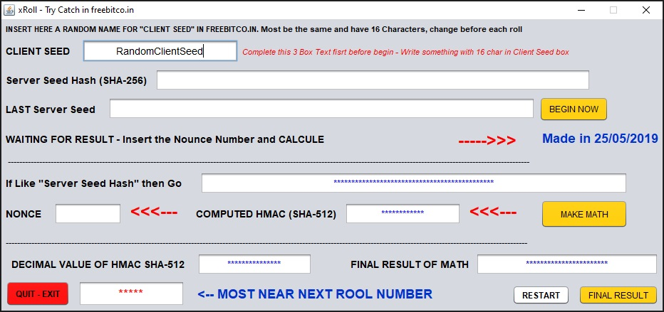

# xRoll

Detailed README for uploading the Java project (NetBean).

> **Note:** This README is written in English. I recommend using Java 8
> to compile/run this project, because it uses
> `javax.xml.bind.DatatypeConverter` (available by default in JDK 8). If
> you use JDK \>= 9, see the section "Compatibility and adjustments".

------------------------------------------------------------------------

## Table of Contents

-   Description
-   Requirements
-   Project structure
-   Import into Eclipse (step by step)
-   Compile and run
-   Generate executable JAR (optional)
-   Dependencies and Java compatibility
-   Security and legal notice
-   How to version / push to GitHub (concrete steps)
-   Recommended `.gitignore`
-   License and contributions

------------------------------------------------------------------------

## Description

xRoll is a small desktop Java (Swing) program that calculates HMAC/SHA
values and performs conversion operations (hex → decimal → calculation).
The provided source code contains the main class `xRoll` with a
graphical interface generated by the NetBeans/Eclipse GUI builder.

> Note: this project seems to be a local utility for cryptographic
> calculations and verification purposes. Use responsibly and comply
> with local laws regarding games/automation.

------------------------------------------------------------------------

## Requirements

1.  **Java Development Kit (JDK) 8** --- tested and recommended.
2.  **Eclipse IDE for Java Developers** (any version compatible with
    Java 8). The project was originally made in older IDEs (NetBeans or
    Eclipse) but has been adapted to standard Java structure.
3.  Git (local) for version control and pushing to GitHub.
4.  Operating system: Windows / Linux / macOS (Java is cross-platform).

------------------------------------------------------------------------

## Project structure

Example structure (Eclipse standard):

    xRoll/
    ├─ .git/
    ├─ src/
    │  └─ antold/
    │     └─ xRoll.java
    ├─ README.md
    ├─ .gitignore
    └─ build/ (optional)

The class `xRoll` is in the `antold` package. If preferred, rename the
package to something more appropriate before publishing.

------------------------------------------------------------------------

## Import into Eclipse (step by step)

1.  Open Eclipse.
2.  `File` → `Import...` → `General` →
    `Existing Projects into Workspace` → `Next`.
3.  Select `Select root directory` and point to the project folder
    containing `src/` and (if present) `.project`.
    -   If you don't have a `.project`, create a new Java project and
        copy the `src/` directory into it.
4.  Make sure the project appears in the list and click `Finish`.
5.  Confirm that `JRE System Library` points to an **Execution
    Environment** compatible with Java 8.

If you prefer to create a new project and paste the package:

1.  `File` → `New` → `Java Project` → Name it `xRoll` → Next → Finish.
2.  Create the package `antold` inside `src` (`New` → `Package`) and
    paste the file `xRoll.java` inside.
3.  Adjust `Project` → `Properties` → `Java Build Path` if needed.

------------------------------------------------------------------------

## Compile and run

In Eclipse:

1.  Right-click on `xRoll.java` → `Run As` → `Java Application`.
2.  The Swing window should open.

From the command line (assuming JDK 8 and project root directory):

``` bash
# compile
javac -d bin -sourcepath src src/antold/xRoll.java

# run
java -cp bin antold.xRoll
```

(If there are references to GUI builder-generated classes, compile all
`*.java` files in `src`.)

------------------------------------------------------------------------

## Generate executable JAR (optional)

In Eclipse:

1.  `File` → `Export...` → `Java` → `Runnable JAR file` → `Next`.
2.  Choose the `Launch configuration` (the class with `main`) ---
    `antold.xRoll` --- and set the destination `JAR file` path.
3.  Select "Package required libraries into generated JAR" (if external
    libs exist).
4.  `Finish`.

From the command line (after compiling):

``` bash
jar cfe xRoll.jar antold.xRoll -C bin .
```

------------------------------------------------------------------------

## Dependencies and Java compatibility

-   The project uses
    `javax.xml.bind.DatatypeConverter.printHexBinary(...)` to convert
    bytes to hex. The `javax.xml.bind` API is available by default in
    JDK 8. From JDK 9 onwards, `javax.xml.bind` was removed from the
    base JDK and requires adding the `jakarta.xml.bind` module or
    replacing it with utility methods (there is a `bytesToHexa` function
    in the code that can also be used).

**Recommendations:** - Use JDK 8 to avoid friction. - If using JDK \>=
9, replace `DatatypeConverter.printHexBinary(hash)` with a local
implementation (e.g., `bytesToHexa(hash)` already in the code) or add
the `jakarta.xml.bind` dependency.

------------------------------------------------------------------------

## Security and legal notice

-   The code deals with HMAC and sensitive data. Do not use real keys in
    public repositories.
-   If this project is related to gambling or website automation (e.g.,
    `freebitco.in` mentioned in comments), check legality and terms of
    service before use/distribution.
-   Do not publish private keys or user data.

------------------------------------------------------------------------

## How to push to GitHub --- step by step

### 1) Create repository on GitHub

-   On GitHub: `New repository` → name it `xRoll` (or another) →
    `Create repository`.

### 2) Initialize and push (local → GitHub)

In terminal, inside the project folder:

``` bash
# initialize local repository (if not already)
git init

# add all files
git add .

# initial commit
git commit -m "Initial commit: xRoll Java Eclipse project"

# add remote (replace <USERNAME> and <REPO>)
git remote add origin https://github.com/<USERNAME>/<REPO>.git

# create main branch and push
git branch -M main
git push -u origin main
```

If the remote repository provides different instructions (e.g., forced
push), follow GitHub's guidance.

------------------------------------------------------------------------

## Recommended `.gitignore`

``` gitignore
# Java
*.class
/bin/
/build/

# Eclipse
.project
.classpath
.settings/

# Mac
.DS_Store

# Logs
*.log

# IDE specific
*.iml
.idea/

# JAR
*.jar

# OS
Thumbs.db
```

------------------------------------------------------------------------

## Suggested code adjustments

1.  **Remove unnecessary import**:
    `import com.sun.imageio.plugins.jpeg.JPEG;` --- apparently unused;
    remove to clean warnings.
2.  **Avoid generic `catch (Exception E)`**: replace with more specific
    catches where possible and log error messages.
3.  **Validate inputs**: check if text fields are not empty before
    parsing `Long.parseLong(hex, 16)` to avoid `NumberFormatException`.
4.  **Internationalization**: hardcoded text can be externalized to
    `ResourceBundle` if desired.
5.  **Licensing**: add a `LICENSE` file (e.g., MIT) if you want to allow
    contributions.

------------------------------------------------------------------------

## Reporting issues / Contributing

-   Open `Issues` in the GitHub repository for bugs / feature requests.
-   To contribute: fork → feature branch → pull request.

------------------------------------------------------------------------

## License

MIT `LICENSE` 

------------------------------------------------------------------------

## Author

-   Created by      : Josemar Pedro.
-   Compiled date   : 01/05/2019.
